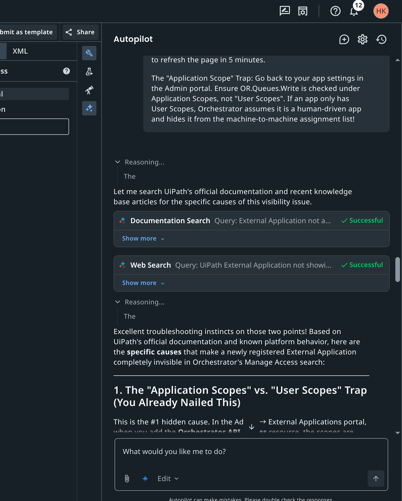
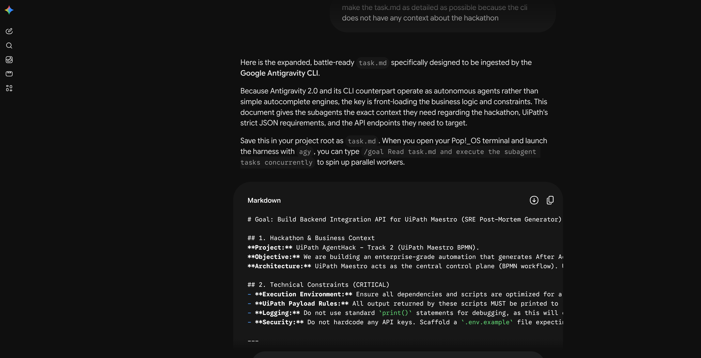
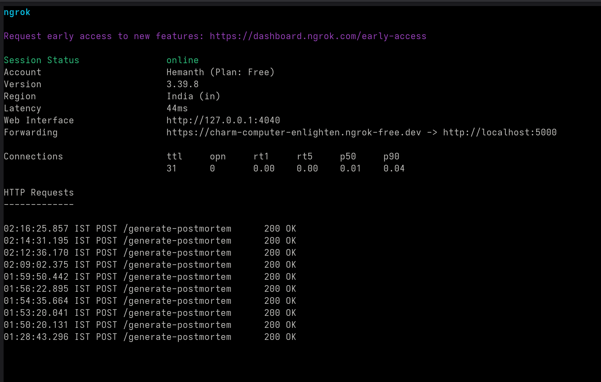

# AutoMortem

**AutoMortem** is an enterprise-grade AI automation tool that instantly generates high-quality, blameless After Action Reports (Post-Mortems) following production incidents. 

By integrating deeply with your communication and version control tools, AutoMortem removes the manual burden of incident documentation so your Site Reliability Engineers (SREs) can focus on building, not paperwork.

## What it does
When an outage is resolved, AutoMortem is triggered via UiPath Maestro. It automatically:
1. **Scrapes** the frantic incident triage chat logs from your Slack `#incident-logs` channel.
2. **Fetches** the most recent codebase changes and commits from your GitHub repository.
3. **Synthesizes** this unstructured data using Generative AI (Google Gemini 2.5 Pro) to cross-reference the chat discussions with the code deployments.
4. **Generates** a beautifully formatted, strictly factual PDF report containing a Chronological Timeline, the Root Cause (linking the exact broken PR), and actionable Next Steps.

## Backend Architecture
AutoMortem relies on a lightweight, highly modular Python backend designed to integrate flawlessly with both UiPath Cloud and external developer tools.
* **Flask Webhook Server (`server.py`):** Acts as the entry point, listening for POST requests from UiPath Maestro when an incident is resolved.
* **Custom API Integrations (`api/`):** Contains modular Python clients (`slack_client.py`, `github_client.py`) built using the `requests` library to fetch the raw data necessary for the post-mortem.
* **LLM Synthesis Engine (`core/synthesizer.py`):** Passes the raw chat logs and git commits to the **Google Gemini 2.5 Pro** LLM via the `google-genai` SDK, using strict prompt engineering to guarantee blameless, hallucination-free markdown output.
* **PDF Generation (`main.py`):** Converts the LLM's raw markdown output into an enterprise-ready PDF document using the `markdown-pdf` library.

## UiPath Components Used
This solution relies heavily on the **UiPath Automation Cloud** for orchestration and logic flow. 


* **UiPath Maestro (BPMN):** The core orchestration engine. As shown in the workflow diagram above, Maestro orchestrates the entire incident resolution lifecycle using several key BPMN elements:
  * **Message Start Event:** Triggers the workflow automatically when a new incident is created.
  * **Timer Event & PagerDuty Integration:** Uses a polling loop with a "Wait 30 seconds" timer and a PagerDuty connector to continuously fetch the incident status.
  * **Exclusive Gateway:** Checks "Is Incident Resolved?". If not, it loops back; if yes, it breaks the loop.
  * **HTTP Request Task:** Once resolved, it fires a POST request to trigger our backend webhook (`server.py`) to generate the Post-Mortem.
* **UiPath Orchestrator & Queues:** Once the PDF is generated, our python API client (`uipath_client.py`) authenticates via OAuth 2.0 (using Confidential Applications and Folder IDs) to push the final status back into an Orchestrator Queue for human review.

## Agent Architecture & AI Integration
This project extensively utilizes **Coding Agents** and generative AI across the entire software development lifecycle:

1. **Antigravity CLI (Agentic Coding):** We used the Antigravity CLI to autonomously write, scaffold, and refactor our Python backend integrations (Slack, GitHub, and UiPath clients). 
   

2. **UiPath Autopilot:** We utilized Autopilot to debug workflows, craft the exact automation steps, and streamline the Maestro configurations.
   

3. **Gemini AIs:** We used Gemini not only as the core synthesis engine *inside* our application (generating the final Markdown PDF), but also during development to craft the `task.md` plans and refine the LLM prompting skills.
   

## Prerequisites
* Python 3.10+
* A Slack Workspace with an installed App/Bot (needs `channels:history` scopes)
* A GitHub Personal Access Token (PAT)
* A Google Gemini API Key
* A UiPath Automation Cloud Account (with Orchestrator Queues and a registered External Application for OAuth)

## Setup Instructions

1. **Clone the repository:**
   ```bash
   git clone https://github.com/guyInTheChair-8bit/AutoMortem.git
   cd AutoMortem
   ```

2. **Install Dependencies:**
   ```bash
   pip install -r requirements.txt
   ```

3. **Environment Variables:**
   Copy the example environment file and fill in your secrets.
   ```bash
   cp .env.example .env
   ```
   *Provide your `GEMINI_API_KEY`, `SLACK_BOT_TOKEN`, `GITHUB_TOKEN`, and UiPath credentials.*

4. **Run the Flask Webhook Server:**
   This server acts as the target for the UiPath Maestro workflow.
   ```bash
   python server.py
   ```
   *(Note: You can expose this local port to Maestro using a tool like Ngrok!)*
   

5. **Trigger from UiPath Maestro:**
   Import the `sre_postmortem_maestro.bpmn` into your UiPath Automation Cloud. Configure the REST API call step to point to your Flask server on the `/generate-postmortem` endpoint.

## License
This project is licensed under the [MIT License](LICENSE).
